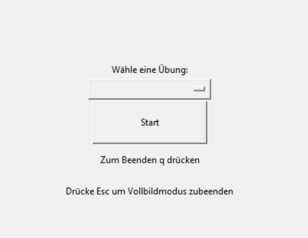

# GymApp

## Was ist die GymApp?

## Wie starte ich das Programm auf meinem Computer

### Python installieren

Downloaden Sie unter <https://www.python.org/downloads/> den Installer für Python und beachten Sie das die Version nur 3.6 bis 3.8 ist. Nur diese Versionen werden von MediaPipe unterstützt.
Führen Sie den Installer aus.
Wichtig: Installationsmaske "Hinzufügen zur Path-Variable" ankreuzen.

### pip installieren

Laden Sie Sich die zip-Datei <https://bootstrap.pypa.io/pip/pip.pyz> herunter
Gehen Sie auf die Webseite <https://pip.pypa.io/en/stable/installation/> für mehr Informationen

### Mediapipe installieren

## Bedienungsanleitung

- Zum starten Klicken Sie in das GUI.py Programm
- Danach können Sie das Ausführfenste mit der Tastkombination Strg + Umschalttaste + D öffnen
- Links sollte sich dann ein Fenster öffnen mit einem Button "Ausführen und debuggen" bzw bei englischer Einstellung "Run and debug". Bitte betättigen Sie diesen.

### Menu

- Beim Anklicken des oberen leerausschauenden Button können Sie Ihre Gewünschte Übung aussuchen.
- Mit betätigen des Start-Button starten Sie das Programm.
Jetzt können Sie Ihre Übung starten.
- Um den Vollbildmodus zubeeden drücken Sie auf "Esc"

### In der Übung

- Links oben können Sie während des Sportes den Anzahl der Wiederholungen sehen.
- Um das Beste aus Ihrer Fitness rauszuholen ist der Zähler nicht begrenzt, damit Sie nicht aufhören müssen wenn Sie mehr geschafft hätten.
- Um die Übung zu beenden, können Sie auf Ihrer Tastatur q betätigen.
